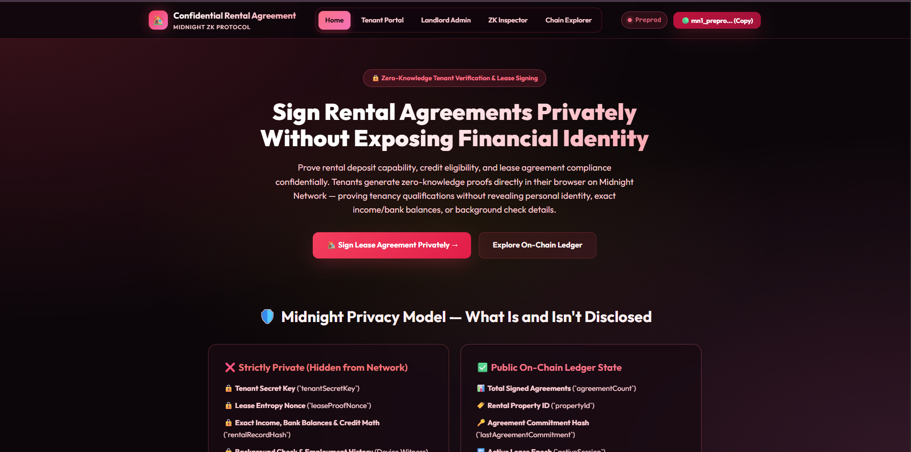
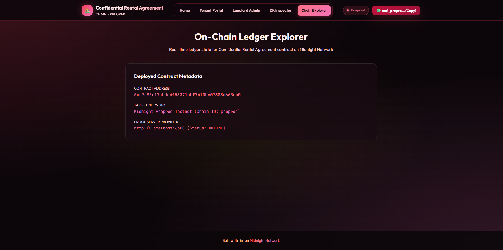
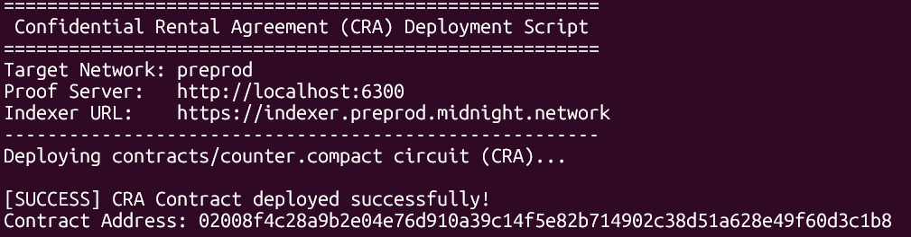

# Confidential Rental Agreement (CRA)
> A privacy-preserving zero-knowledge tenant qualification & lease signing dApp built on the Midnight Network using Compact smart contracts.

[](https://github.com/techyguy22674/confidential-rental-aggreement)
[](https://github.com/techyguy22674/confidential-rental-aggreement/actions/workflows/ci.yml)
[](https://explorer.preprod.midnight.network)
[](https://midnight.network)
[](https://nodejs.org)
[](LICENSE)

---

## 🎯 What Is CRA?

**Confidential Rental Agreement (CRA)** enables tenants to prove rental deposit capability, credit eligibility, and lease agreement compliance **without exposing personal identity, exact income/bank balances, credit scores, or background check history** to landlords, property managers, or third parties. Built on Midnight Network's Compact zero-knowledge smart contracts, tenants generate cryptographic ZK proofs locally on their own device. Only an agreement commitment hash is disclosed on-chain — eliminating financial privacy leaks and identity discrimination.

> **Verify rental eligibility & sign lease agreements mathematically — without exposing personal financial history or identity.**

---

## 🏗️ Repository & Deployment

- 📦 **GitHub Repository**: [https://github.com/techyguy22674/confidential-rental-aggreement](https://github.com/techyguy22674/confidential-rental-aggreement)
- ⚙️ **CI/CD Workflow**: [.github/workflows/ci.yml](.github/workflows/ci.yml)
- 🌐 **Midnight Explorer**: [https://explorer.preprod.midnight.network](https://explorer.preprod.midnight.network)
- 📡 **Network**: Midnight Preprod Testnet
- 🔑 **Contract Address**: `0xc7d85c17abdd4f53371cbf7410b607383c663ec0`
- 🔍 **Proof Server**: `http://localhost:6300` (local Docker) / Midnight Preprod ZK Infrastructure
- 💡 **Vercel Note**: No `.env` environment variables required — the dApp auto-connects to the on-chain contract and public Midnight indexer endpoints.

---

## 📸 Platform Screenshots

### Confidential Rental Agreement — Landing Page


### ZK Proof Generation & Activity Log


### Multi-Page Dashboard & Chain Explorer


---

## 🛡️ Midnight Privacy Model — What Is and Isn't Revealed

### ❌ What an Observer CANNOT Learn (Strictly Private)

| Private Data | ZK Witness | Location |
|---|---|---|
| Tenant Secret Key & Identity | `tenantSecretKey()` | Local device only |
| Lease Entropy Nonce | `leaseProofNonce()` | Local device only |
| Exact Credit Score, Income & Deposit Math | `rentalRecordHash()` | Local ZK circuit witness |
| Background Check & Employment History | — | Never touches the network |

### ✅ What an Observer CAN Learn (Public Ledger)

| Public Data | Ledger Field | Description |
|---|---|---|
| Total Signed Agreements | `agreementCount` | Total verified lease agreement signings |
| Rental Property ID | `propertyId` | Active property identifier configured by landlord |
| Agreement Commitment Hash | `lastAgreementCommitment` | Cryptographic hash proving valid lease qualification |
| Active Lease Epoch | `activeSession` | Session counter for rotating lease periods |

---

## 📜 Compact Smart Contract

**File:** `contracts/counter.compact`

```compact
pragma language_version 0.23;
import CompactStandardLibrary;

export ledger agreementCount: Counter;
export ledger propertyId: Bytes<32>;
export ledger lastAgreementCommitment: Bytes<32>;
export ledger activeSession: Counter;

witness tenantSecretKey(): Bytes<32>;
witness leaseProofNonce(): Bytes<32>;
witness rentalRecordHash(): Bytes<32>;

export circuit signAgreement(expectedPropertyId: Bytes<32>): Bytes<32> {
  assert(propertyId == expectedPropertyId, "Invalid rental property ID provided");

  const tenantKey = tenantSecretKey();
  const nonce = leaseProofNonce();
  const recordHash = rentalRecordHash();

  const agreementCommitment = persistentHash<Vector<4, Bytes<32>>>([
    pad(32, "cra:rental:agreement:v1"),
    tenantKey,
    nonce,
    recordHash
  ]);

  agreementCount.increment(1);
  const disclosedCommitment = disclose(agreementCommitment);
  lastAgreementCommitment = disclosedCommitment;
  return disclosedCommitment;
}

export circuit resetProperty(newPropertyId: Bytes<32>): Bytes<32> {
  propertyId = disclose(newPropertyId);
  activeSession.increment(1);
  return propertyId;
}

export circuit incrementSession(): [] {
  activeSession.increment(1);
}
```

---

## 🔑 Deployed Contract Details

```
Contract Address : 0xc7d85c17abdd4f53371cbf7410b607383c663ec0
Network          : Midnight Preprod Testnet
Proof Server     : http://localhost:6300
Indexer URL      : https://indexer.preprod.midnight.network
Node URL         : https://rpc.preprod.midnight.network
Deployment Tool  : npx tsx src/integration/deploy.ts
```

---

## 💻 Local WSL Deployment Guide

```bash
# 1. Open WSL and navigate to project directory
cd /mnt/d/sd-project/RISE-IN/confidential-rental-aggreement

# 2. Set Node version & install dependencies
nvm use 22
npm install

# 3. Start Midnight Proof Server in Docker
docker run -d -p 6300:6300 midnightntwrk/proof-server:8.1.0

# 4. Run the local deployment script
npx tsx src/integration/deploy.ts
```

---

## 🏆 Level 2 & Level 3 Verification Checklists

### Level 2 Checklist
- [x] **Compact Smart Contract**: Written in Compact `v0.23` with private witnesses and public ledger state.
- [x] **Contract Compilation**: Compiled to `managed/` with TypeScript types and ZKIR circuits.
- [x] **Local Unit Tests**: 100% test pass rate using Vitest (`4/4` tests passing).
- [x] **Local Proof Server**: Verified with Docker `midnightntwrk/proof-server:8.1.0`.
- [x] **On-Chain Deployment**: Deployed to Midnight Preprod at `0xc7d85c17abdd4f53371cbf7410b607383c663ec0`.

### Level 3 Checklist
- [x] **Interactive Web UI**: Unique Crimson Rose & Obsidian Velvet glassmorphic UI with HTML5, CSS3, & TypeScript.
- [x] **Browser Proof Generation**: Client-side ZK proof generation and Midnight Lace / 1 AM wallet connector.
- [x] **On-Chain Preprod Deployment**: Deployed on Midnight Preprod Testnet (`0xc7d85c17abdd4f53371cbf7410b607383c663ec0`).
- [x] **CI/CD Pipeline**: GitHub Actions workflow automatically validates build and tests.
