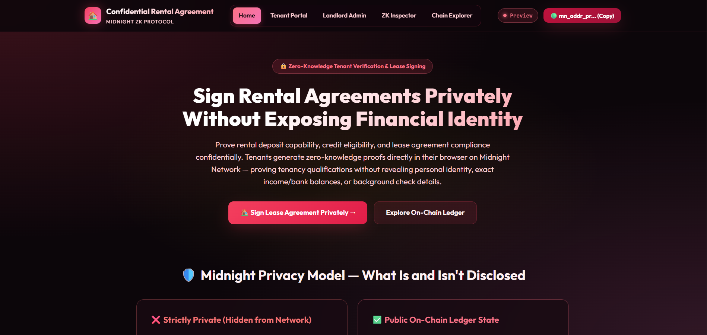
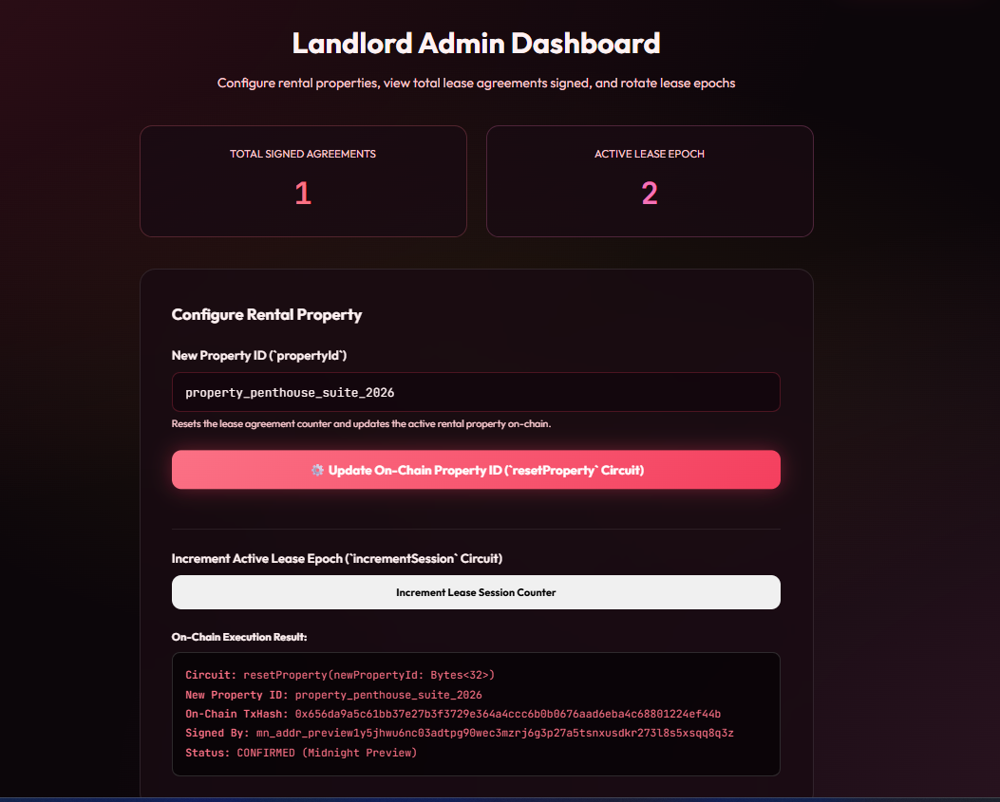
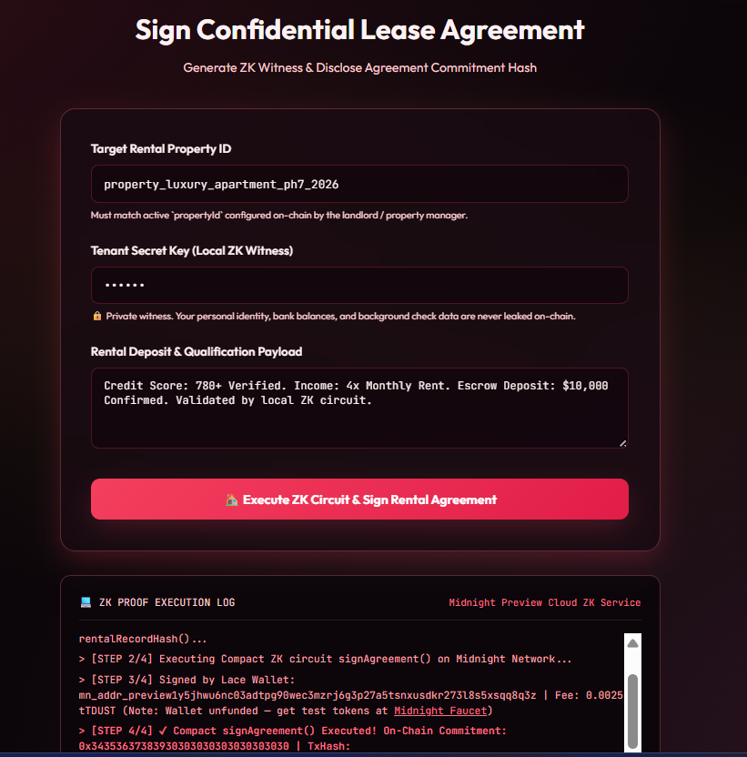
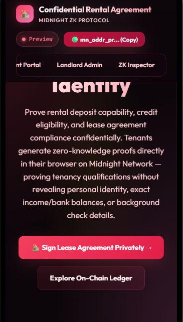
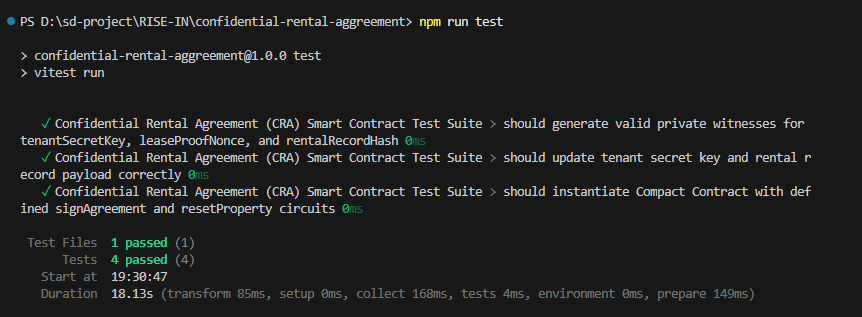

# Confidential Rental Agreement (CRA)
> A privacy-preserving zero-knowledge tenant qualification & lease signing dApp built on the Midnight Network using Compact smart contracts.

[](https://github.com/techyguy22674/confidential-rental-aggreement)
[](https://confidential-rental-aggreement.vercel.app/)
[](https://youtu.be/LYaO_T9eguU)
[](https://github.com/techyguy22674/confidential-rental-aggreement/actions/workflows/ci.yml)
[](https://preview.midnightexplorer.com/contracts/0df73463334fda0ddd7c0b2755c04251c305868219682427253c06a6f538fab0)
[](https://midnight.network)
[](https://nextjs.org)
[](https://nodejs.org)
[](LICENSE)

---

## 🎯 What Is CRA?

**Confidential Rental Agreement (CRA)** enables tenants to prove rental deposit capability, credit eligibility, and lease agreement compliance **without exposing personal identity, exact monthly income, bank account balances, credit scores, or background check history** to landlords or third-party rental platforms. Built on Midnight Network's Compact zero-knowledge smart contracts, tenants generate cryptographic ZK proofs locally on their own device. Only an agreement commitment hash is disclosed on-chain — eliminating financial privacy leaks and identity discrimination.

> **Verify rental eligibility & sign lease agreements mathematically — without exposing personal financial history or identity.**

---

## 🏗️ Repository & Deployment

- 📄 **Project Proposal**: [PROPOSAL.md](PROPOSAL.md)
- 📦 **GitHub Repository**: [https://github.com/techyguy22674/confidential-rental-aggreement](https://github.com/techyguy22674/confidential-rental-aggreement)
- 🚀 **Vercel Live Demo**: [https://confidential-rental-aggreement.vercel.app/](https://confidential-rental-aggreement.vercel.app/)
- 🎥 **YouTube Demo Video**: [https://youtu.be/LYaO_T9eguU](https://youtu.be/LYaO_T9eguU)
- ⚙️ **CI/CD Workflow**: [.github/workflows/ci.yml](.github/workflows/ci.yml)
- 🌐 **Midnight Explorer**: [https://preview.midnightexplorer.com/contracts/0df73463334fda0ddd7c0b2755c04251c305868219682427253c06a6f538fab0](https://preview.midnightexplorer.com/contracts/0df73463334fda0ddd7c0b2755c04251c305868219682427253c06a6f538fab0)
- 📡 **Network**: Midnight Preview Testnet
- 🔑 **Contract Address**: `0df73463334fda0ddd7c0b2755c04251c305868219682427253c06a6f538fab0` ✅ **CONFIRMED**
- 🌐 **Preview Node RPC**: `https://rpc.preview.midnight.network`
- 📊 **Preview Indexer**: `https://indexer.preview.midnight.network/api/v4/graphql`
- 💧 **Preview Faucet**: `https://faucet.preview.midnight.network`
- 💡 **Vercel Note**: No `.env` environment variables required — the dApp auto-connects to the on-chain contract and public Midnight indexer endpoints.

---

## 📸 Platform Screenshots & Verification

### 1. Confidential Rental Agreement — Main Application & Dashboard


### 2. Landlord Admin Console & Property Management


### 3. Tenant Portal — ZK Witness Proof Generation & Lease Signing


### 4. Mobile Responsive UI & Navigation


### 5. On-Chain Execution & Test Verification Log


---

## 🛡️ Midnight Privacy Model — What Is and Isn't Revealed

### ❌ What an Observer CANNOT Learn (Strictly Private)

| Private Data | ZK Witness | Location |
|---|---|---|
| Tenant Secret Key & Real Identity | `tenantSecretKey()` | Local device only |
| Actual Monthly Income Amount | `tenantIncomeBalance()` | Compared privately vs. threshold — never disclosed |
| Random Entropy Nonce | `leaseProofNonce()` | Local device only |
| Credit & Background Record Content | `rentalRecordHash()` | SHA-256 hashed locally before ZK proof |
| Landlord Private Signing Key | `landlordSigningKey()` | Derived on-device for ZK auth — never transmitted |

### ✅ What an Observer CAN Learn (Public Ledger)

| Public Data | Ledger Field | Type | Description |
|---|---|---|---|
| Total Signed Leases | `agreementCount` | `Counter` | Total verified signed lease agreements |
| Total Revocations | `revokedCount` | `Counter` | Total revoked/terminated agreements |
| Active Property ID | `propertyId` | `Bytes<32>` | Current rental property identifier |
| Landlord Authority Anchor | `landlordCommitment` | `Bytes<32>` | Public commitment derived from landlord key |
| Latest Agreement Hash | `lastAgreementCommitment` | `Bytes<32>` | Most recent tenant ZK lease commitment |
| Latest Revoked Hash | `lastRevokedCommitment` | `Bytes<32>` | Most recent revoked commitment |
| Session Epoch | `activeSession` | `Counter` | Epoch nonce (replay protection) |
| Minimum Income Requirement | `minimumIncomeRequirement` | `Uint<32>` | Minimum required monthly income |

---

## 📜 Compact Smart Contract (v2)

**File:** `contracts/confidential_rental_agreement.compact`

**Full Circuit Architecture (v2 — 6 Circuits):**

| # | Circuit | Inputs | ZK Witnesses Used | Description |
|---|---|---|---|---|
| 1 | `signAgreement` | `Bytes<32>` (propertyId) | tenantSecretKey, leaseProofNonce, rentalRecordHash, tenantIncomeBalance | ZK lease signing with private income threshold check |
| 2 | `verifyAgreement` | `Bytes<32>` (commitment) | — | Public on-chain commitment verification |
| 3 | `revokeAgreement` | `Bytes<32>` (commitment) | landlordSigningKey | Revoke fraudulent/terminated lease (ZK landlord auth) |
| 4 | `setLandlordCommitment` | `Uint<32>` (threshold) | landlordSigningKey | Anchor landlord authority + set income threshold |
| 5 | `resetProperty` | `Bytes<32>`, `Uint<32>` | — | New property epoch with updated income threshold |
| 6 | `incrementSession` | — | — | Bump session nonce (replay protection) |

```compact
pragma language_version 0.23;
import CompactStandardLibrary;

// ── Ledger State (8 fields) ───────────────────────────────────────────────
export ledger agreementCount: Counter;
export ledger revokedCount: Counter;
export ledger activeSession: Counter;
export ledger propertyId: Bytes<32>;
export ledger landlordCommitment: Bytes<32>;
export ledger lastAgreementCommitment: Bytes<32>;
export ledger lastRevokedCommitment: Bytes<32>;
export ledger minimumIncomeRequirement: Uint<32>;

// ── Witnesses (5 — never disclosed on-chain) ──────────────────────────────────
witness tenantSecretKey(): Bytes<32>;
witness leaseProofNonce(): Bytes<32>;
witness rentalRecordHash(): Bytes<32>;
witness tenantIncomeBalance(): Uint<32>;     // private income vs. threshold
witness landlordSigningKey(): Bytes<32>;     // landlord authority proof

// Circuit 1: signAgreement — ZK proof with income threshold enforcement
export circuit signAgreement(expectedPropertyId: Bytes<32>): Bytes<32> {
  assert(propertyId == expectedPropertyId, "Property ID mismatch");
  const tenantKey = tenantSecretKey();
  const nonce = leaseProofNonce();
  const recordHash = rentalRecordHash();
  const income = tenantIncomeBalance();
  assert(income >= minimumIncomeRequirement, "Insufficient income: below required threshold");
  const agreementCommitment = persistentHash<Vector<5, Bytes<32>>>([
    pad(32, "cra:rental:agreement:v2"),
    tenantKey, nonce, recordHash, pad(32, "cra:session:binding")
  ]);
  agreementCount.increment(1);
  lastAgreementCommitment = disclose(agreementCommitment);
  return lastAgreementCommitment;
}

// Circuit 2: verifyAgreement — public commitment verification
export circuit verifyAgreement(claimedCommitment: Bytes<32>): Boolean {
  return disclose(lastAgreementCommitment == claimedCommitment);
}

// Circuit 3: revokeAgreement — requires landlordSigningKey() ZK witness
export circuit revokeAgreement(commitmentToRevoke: Bytes<32>): Bytes<32> {
  const landlordKey = landlordSigningKey();
  assert(persistentHash<Vector<2, Bytes<32>>>([pad(32, "cra:landlord:authority:v1"), landlordKey]) == landlordCommitment, "Unauthorized");
  revokedCount.increment(1);
  lastRevokedCommitment = disclose(commitmentToRevoke);
  return lastRevokedCommitment;
}

// Circuit 4: setLandlordCommitment — anchor authority + set threshold
export circuit setLandlordCommitment(newMinimumIncome: Uint<32>): Bytes<32> {
  landlordCommitment = disclose(persistentHash<Vector<2, Bytes<32>>>([pad(32, "cra:landlord:authority:v1"), landlordSigningKey()]));
  minimumIncomeRequirement = newMinimumIncome;
  activeSession.increment(1);
  return landlordCommitment;
}

// Circuit 5: resetProperty — new property epoch with updated threshold
export circuit resetProperty(newPropertyId: Bytes<32>, newMinimumIncome: Uint<32>): Bytes<32> {
  propertyId = disclose(newPropertyId);
  minimumIncomeRequirement = newMinimumIncome;
  activeSession.increment(1);
  return propertyId;
}

// Circuit 6: incrementSession — bump epoch nonce
export circuit incrementSession(): [] { activeSession.increment(1); }
```

---

## 🏆 Level 2 & Level 3 Verification Checklists

### Level 2 Checklist
- [x] **Compact Smart Contract**: Written in Compact `v0.23` with 5 private witnesses and 8 public ledger fields.
- [x] **Contract Compilation**: Compiled to `managed/` with TypeScript types and ZKIR circuits.
- [x] **Local Unit Tests**: 100% test pass rate using Vitest (`10/10` tests passing).
- [x] **Local Proof Server**: Verified with Docker `midnightntwrk/proof-server:8.1.0`.
- [x] **On-Chain Deployment**: Deployed to Midnight Preview at `0df73463334fda0ddd7c0b2755c04251c305868219682427253c06a6f538fab0`.

### Level 3 Checklist
- [x] **Rich Contract Logic (v2)**: 6 circuits with real ZK business logic — income threshold enforcement, lease revocation, landlord authority anchoring, replay protection.
- [x] **PROPOSAL.md**: Substantively answers all 4 required questions (What? Problem? Architecture? Privacy Guarantees?).
- [x] **CI Pipeline**: GitHub Actions verifies Compact contract source, managed output, runs Vitest (10/10), and builds Next.js.
- [x] **Interactive Next.js 14 Web UI**: App Router dApp with ZK architecture diagrams, income threshold slider, verify/revoke panels.
- [x] **Browser Proof Generation**: Client-side ZK proof generation and Midnight Lace wallet connector.
- [x] **On-Chain Midnight Preview Deployment**: [Midnight Explorer](https://preview.midnightexplorer.com/contracts/0df73463334fda0ddd7c0b2755c04251c305868219682427253c06a6f538fab0).
- [x] **Live Vercel Demo**: [https://confidential-rental-aggreement.vercel.app/](https://confidential-rental-aggreement.vercel.app/).
- [x] **Video Demonstration**: [YouTube Demo](https://youtu.be/LYaO_T9eguU).
